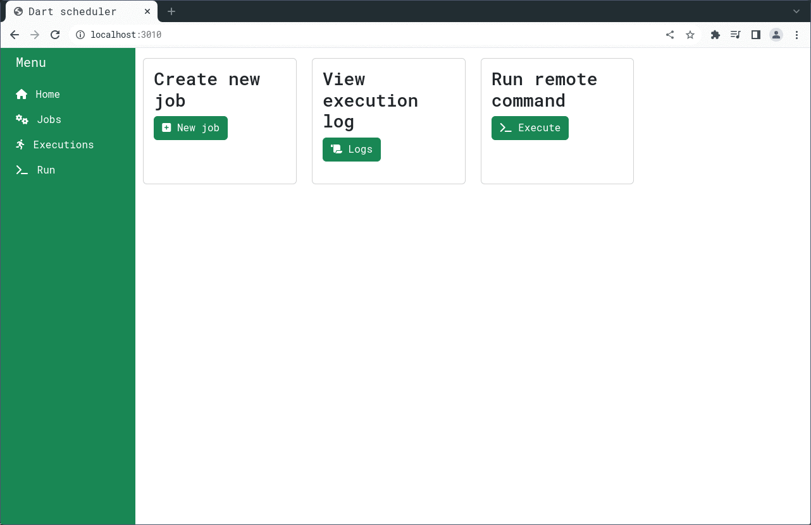
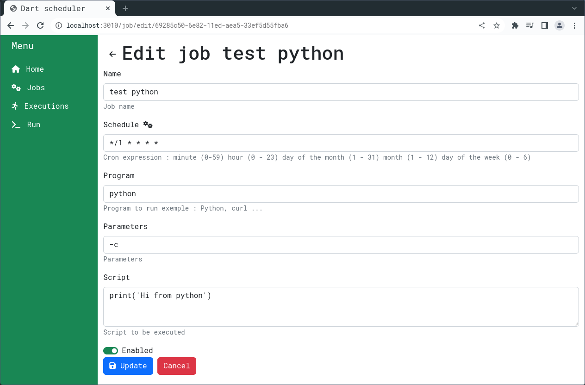

# Introduction
Dart scheduler allows you to run agnostic cron and jobs, on any OS🔥

# How to run

## Docker
With Python and NodeJS already embedded 👍
```
docker run -d -p 3010:3010 --name scheduler dart-scheduler:1  \
-e DART_SCHEDULER_ENV='development' \
-e DART_SCHEDULER_PORT='3010' \
-e DART_SCHEDULER_HOST: 0.0.0.0\
-e DART_SCHEDULER_AES_CIPHER='2,3,2,10,3,77,2,3,31,2,65,151,35,111,1,2,3,9,2,64,111,7,111,1,2,3,211,2,34,111,33,111' \
-e DART_SCHEDULER_DB_PATH='/home/db' 
```
## Docker compose
```
version: "3.9"
services:
  web:
    image: naoufalzerai/dart_scheduler
    ports:
      - "3010:3010"
    volumes:
      - ../compose-test:/db
    environment:
      DART_SCHEDULER_ENV: production
      DART_SCHEDULER_HOST: 0.0.0.0
      DART_SCHEDULER_PORT: 3010
      DART_SCHEDULER_AES_CIPHER: 2,3,2,1,3,77,2,3,31,2,65,111,35,111,1,2,3,9,2,64,111,7,111,1,2,3,211,2,34,111,33,111
      DART_SCHEDULER_DB_PATH: /db
```

## From source
Make sure you have [Dart](https://dart.dev/get-dart) instaled 

1. Clone the repo
```
Git clone https://github.com/naoufalzerai/dart_scheduler.git
```
2. Open the folder
```
cd dart_scheduler
```
3. Build the project 
```
dart compile exe -o dart_scheduler.exe lib/main.dart   
```
4. Create .env config
```
DART_SCHEDULER_ENV = development
DART_SCHEDULER_HOST = 0.0.0.0
DART_SCHEDULER_PORT = 3010
DART_SCHEDULER_AES_CIPHER = 2,3,2,10,3,77,2,3,31,2,65,151,35,111,1,2,3,9,2,64,111,7,111,1,2,3,211,2,34,111,33,111
DART_SCHEDULER_DB_PATH = /home/db
```

1. Execute dart_scheduler.exe
```
./dart_scheduler.exe 
```

## From binaries (Linux/Windows/Macos)

[Here](https://github.com/naoufalzerai/dart_scheduler/releases)

# Exemple
## GUI
### Script

### Python

### NodeJS

### REST API

## Web Api
Availble endpoints : 

    GET     /job
    POST    /job
    DELETE  /job
    GET     /job/create
    GET     /job/edit/:id
    POST    /job/toggle/:id
    GET     /job/:id
    PUT     /job/:id
    DELETE  /job/:id
    GET     /execution
    DELETE  /execution
    GET     /execution/:id
    DELETE  /execution/:id
    GET     /run/ws
    
# Todo list:
- [ ] Authentification
- [ ] CORS config
- [ ] Unit testing
- [ ] Triger job
- [x] API
- [x] Auto refresh
- [x] Visual coherence
- [x] Add CMD
- [x] Filter and sort table
- [x] Docker-compose
- [x] Edit 
- [x] Enable/disable
- [x] Wipe logs 
- [x] Start/Stop 
- [x] Delete
  - [x] Stop execs
  - [x] Delete Job + Logs
- [x] Run script
- [x] Sort executions by date
- [x] Bug first job didn't show
